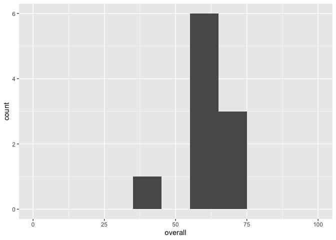

Course grades
================

``` r
library(googlesheets4)
library(janitor)
library(tidyverse)
library(gt)
library(knitr)
```

## Setup

Load grade data from
[here](https://docs.google.com/spreadsheets/d/1teXA9Uhtl3KuXbIZBEeDb6v9-Y9uE01lpoQ9fx_dS0Y/edit?usp=sharing).

``` r
roster <- read_sheet("https://docs.google.com/spreadsheets/d/1teXA9Uhtl3KuXbIZBEeDb6v9-Y9uE01lpoQ9fx_dS0Y/edit?usp=sharing") %>%
  clean_names() %>%
  # not an actual numeric variable
  mutate(student_id = as.character(student_id))
```

Set maximum scores and weights for each assignment type.

``` r
# max scores for each assignment type
hw_max <- 50
lab_max <- 20
project_max <- 100
quiz_max <- 10

# weights for each assignment type
hw_weight <- 0.50
lab_weight <- 0.20
project_weight <- 0.20
quiz_weight <- 0.10
```

Create two custom functions: drop lowest and take average
(`mean_drop_lowest()`) and count number of missing assignments
(`count_missing()`).

``` r
mean_drop_lowest <- function(x){
  y <- x[-which(x == min(x))[1]]
  mean(y)
}
```

``` r
count_missing <- function(x){
  sum(x == 0)
}
```

Calculate grades, dropping lowest score of each type of assignment.

``` r
graded_roster <- roster %>%
  # replace all NAs with 0s
  replace(is.na(.), 0) %>%
  rowwise() %>%
  # calculate n_missing
  mutate(
    n_missing = count_missing(c_across(where(is.numeric)))
  ) %>%
  # calculate averages, weighted averages, and overall score
  mutate(
    hw_avg = mean_drop_lowest(c_across(starts_with("hw"))),
    lab_avg = mean_drop_lowest(c_across(starts_with("lab"))),
    quiz_avg = mean_drop_lowest(c_across(starts_with("quiz")))
  ) %>%
  mutate(
    hw = hw_avg / hw_max * 100,
    lab = lab_avg / lab_max * 100,
    quiz = quiz_avg / quiz_max * 100,
    overall = (hw * hw_weight) + 
              (lab * lab_weight) + 
              (quiz * quiz_weight) + 
              (project * project_weight)
  ) %>%
  # reorder columns
  select(student_id, name, starts_with("hw"), starts_with("lab"), starts_with("quiz"), project, overall, n_missing) %>%
  select(-hw_avg, -quiz_avg, -lab_avg) %>%
  ungroup()
```

## Grading roster

``` r
graded_roster %>%
  arrange(desc(overall)) %>%
  gt() %>%
  tab_spanner(label = "HW", columns = vars(hw_1, hw_2, hw_3, hw)) %>%
  tab_spanner(label = "Lab", columns = vars(lab_1, lab_2, lab_3, lab)) %>%
  tab_spanner(label = "Quiz", columns = vars(quiz_1, quiz_2, quiz_3, quiz)) %>%
  tab_style(
    style = cell_text(weight = "bold"),
    locations = cells_body(columns = vars(hw, lab, quiz, project, overall))
    ) %>%
  tab_style(
    style = cell_fill(color = "pink"),
    locations = cells_body(rows = overall < 40)
    ) %>%
  tab_style(
    style = cell_fill(color = "orange"),
    locations = cells_body(rows = overall >= 40 & overall < 60)
    ) %>%
  tab_style(
    style = cell_text(color = "red"),
    locations = cells_body(
      columns = vars(n_missing),
      rows = n_missing > 2)
  )
```

<!--html_preserve-->

<style>html {
  font-family: -apple-system, BlinkMacSystemFont, 'Segoe UI', Roboto, Oxygen, Ubuntu, Cantarell, 'Helvetica Neue', 'Fira Sans', 'Droid Sans', Arial, sans-serif;
}

#vexnktnazc .gt_table {
  display: table;
  border-collapse: collapse;
  margin-left: auto;
  margin-right: auto;
  color: #333333;
  font-size: 16px;
  background-color: #FFFFFF;
  width: auto;
  border-top-style: solid;
  border-top-width: 2px;
  border-top-color: #A8A8A8;
  border-right-style: none;
  border-right-width: 2px;
  border-right-color: #D3D3D3;
  border-bottom-style: solid;
  border-bottom-width: 2px;
  border-bottom-color: #A8A8A8;
  border-left-style: none;
  border-left-width: 2px;
  border-left-color: #D3D3D3;
}

#vexnktnazc .gt_heading {
  background-color: #FFFFFF;
  text-align: center;
  border-bottom-color: #FFFFFF;
  border-left-style: none;
  border-left-width: 1px;
  border-left-color: #D3D3D3;
  border-right-style: none;
  border-right-width: 1px;
  border-right-color: #D3D3D3;
}

#vexnktnazc .gt_title {
  color: #333333;
  font-size: 125%;
  font-weight: initial;
  padding-top: 4px;
  padding-bottom: 4px;
  border-bottom-color: #FFFFFF;
  border-bottom-width: 0;
}

#vexnktnazc .gt_subtitle {
  color: #333333;
  font-size: 85%;
  font-weight: initial;
  padding-top: 0;
  padding-bottom: 4px;
  border-top-color: #FFFFFF;
  border-top-width: 0;
}

#vexnktnazc .gt_bottom_border {
  border-bottom-style: solid;
  border-bottom-width: 2px;
  border-bottom-color: #D3D3D3;
}

#vexnktnazc .gt_col_headings {
  border-top-style: solid;
  border-top-width: 2px;
  border-top-color: #D3D3D3;
  border-bottom-style: solid;
  border-bottom-width: 2px;
  border-bottom-color: #D3D3D3;
  border-left-style: none;
  border-left-width: 1px;
  border-left-color: #D3D3D3;
  border-right-style: none;
  border-right-width: 1px;
  border-right-color: #D3D3D3;
}

#vexnktnazc .gt_col_heading {
  color: #333333;
  background-color: #FFFFFF;
  font-size: 100%;
  font-weight: normal;
  text-transform: inherit;
  border-left-style: none;
  border-left-width: 1px;
  border-left-color: #D3D3D3;
  border-right-style: none;
  border-right-width: 1px;
  border-right-color: #D3D3D3;
  vertical-align: bottom;
  padding-top: 5px;
  padding-bottom: 6px;
  padding-left: 5px;
  padding-right: 5px;
  overflow-x: hidden;
}

#vexnktnazc .gt_column_spanner_outer {
  color: #333333;
  background-color: #FFFFFF;
  font-size: 100%;
  font-weight: normal;
  text-transform: inherit;
  padding-top: 0;
  padding-bottom: 0;
  padding-left: 4px;
  padding-right: 4px;
}

#vexnktnazc .gt_column_spanner_outer:first-child {
  padding-left: 0;
}

#vexnktnazc .gt_column_spanner_outer:last-child {
  padding-right: 0;
}

#vexnktnazc .gt_column_spanner {
  border-bottom-style: solid;
  border-bottom-width: 2px;
  border-bottom-color: #D3D3D3;
  vertical-align: bottom;
  padding-top: 5px;
  padding-bottom: 6px;
  overflow-x: hidden;
  display: inline-block;
  width: 100%;
}

#vexnktnazc .gt_group_heading {
  padding: 8px;
  color: #333333;
  background-color: #FFFFFF;
  font-size: 100%;
  font-weight: initial;
  text-transform: inherit;
  border-top-style: solid;
  border-top-width: 2px;
  border-top-color: #D3D3D3;
  border-bottom-style: solid;
  border-bottom-width: 2px;
  border-bottom-color: #D3D3D3;
  border-left-style: none;
  border-left-width: 1px;
  border-left-color: #D3D3D3;
  border-right-style: none;
  border-right-width: 1px;
  border-right-color: #D3D3D3;
  vertical-align: middle;
}

#vexnktnazc .gt_empty_group_heading {
  padding: 0.5px;
  color: #333333;
  background-color: #FFFFFF;
  font-size: 100%;
  font-weight: initial;
  border-top-style: solid;
  border-top-width: 2px;
  border-top-color: #D3D3D3;
  border-bottom-style: solid;
  border-bottom-width: 2px;
  border-bottom-color: #D3D3D3;
  vertical-align: middle;
}

#vexnktnazc .gt_striped {
  background-color: rgba(128, 128, 128, 0.05);
}

#vexnktnazc .gt_from_md > :first-child {
  margin-top: 0;
}

#vexnktnazc .gt_from_md > :last-child {
  margin-bottom: 0;
}

#vexnktnazc .gt_row {
  padding-top: 8px;
  padding-bottom: 8px;
  padding-left: 5px;
  padding-right: 5px;
  margin: 10px;
  border-top-style: solid;
  border-top-width: 1px;
  border-top-color: #D3D3D3;
  border-left-style: none;
  border-left-width: 1px;
  border-left-color: #D3D3D3;
  border-right-style: none;
  border-right-width: 1px;
  border-right-color: #D3D3D3;
  vertical-align: middle;
  overflow-x: hidden;
}

#vexnktnazc .gt_stub {
  color: #333333;
  background-color: #FFFFFF;
  font-size: 100%;
  font-weight: initial;
  text-transform: inherit;
  border-right-style: solid;
  border-right-width: 2px;
  border-right-color: #D3D3D3;
  padding-left: 12px;
}

#vexnktnazc .gt_summary_row {
  color: #333333;
  background-color: #FFFFFF;
  text-transform: inherit;
  padding-top: 8px;
  padding-bottom: 8px;
  padding-left: 5px;
  padding-right: 5px;
}

#vexnktnazc .gt_first_summary_row {
  padding-top: 8px;
  padding-bottom: 8px;
  padding-left: 5px;
  padding-right: 5px;
  border-top-style: solid;
  border-top-width: 2px;
  border-top-color: #D3D3D3;
}

#vexnktnazc .gt_grand_summary_row {
  color: #333333;
  background-color: #FFFFFF;
  text-transform: inherit;
  padding-top: 8px;
  padding-bottom: 8px;
  padding-left: 5px;
  padding-right: 5px;
}

#vexnktnazc .gt_first_grand_summary_row {
  padding-top: 8px;
  padding-bottom: 8px;
  padding-left: 5px;
  padding-right: 5px;
  border-top-style: double;
  border-top-width: 6px;
  border-top-color: #D3D3D3;
}

#vexnktnazc .gt_table_body {
  border-top-style: solid;
  border-top-width: 2px;
  border-top-color: #D3D3D3;
  border-bottom-style: solid;
  border-bottom-width: 2px;
  border-bottom-color: #D3D3D3;
}

#vexnktnazc .gt_footnotes {
  color: #333333;
  background-color: #FFFFFF;
  border-bottom-style: none;
  border-bottom-width: 2px;
  border-bottom-color: #D3D3D3;
  border-left-style: none;
  border-left-width: 2px;
  border-left-color: #D3D3D3;
  border-right-style: none;
  border-right-width: 2px;
  border-right-color: #D3D3D3;
}

#vexnktnazc .gt_footnote {
  margin: 0px;
  font-size: 90%;
  padding: 4px;
}

#vexnktnazc .gt_sourcenotes {
  color: #333333;
  background-color: #FFFFFF;
  border-bottom-style: none;
  border-bottom-width: 2px;
  border-bottom-color: #D3D3D3;
  border-left-style: none;
  border-left-width: 2px;
  border-left-color: #D3D3D3;
  border-right-style: none;
  border-right-width: 2px;
  border-right-color: #D3D3D3;
}

#vexnktnazc .gt_sourcenote {
  font-size: 90%;
  padding: 4px;
}

#vexnktnazc .gt_left {
  text-align: left;
}

#vexnktnazc .gt_center {
  text-align: center;
}

#vexnktnazc .gt_right {
  text-align: right;
  font-variant-numeric: tabular-nums;
}

#vexnktnazc .gt_font_normal {
  font-weight: normal;
}

#vexnktnazc .gt_font_bold {
  font-weight: bold;
}

#vexnktnazc .gt_font_italic {
  font-style: italic;
}

#vexnktnazc .gt_super {
  font-size: 65%;
}

#vexnktnazc .gt_footnote_marks {
  font-style: italic;
  font-size: 65%;
}
</style>

<div id="vexnktnazc" style="overflow-x:auto;overflow-y:auto;width:auto;height:auto;">

<table class="gt_table">

<thead class="gt_col_headings">

<tr>

<th class="gt_col_heading gt_center gt_columns_bottom_border" rowspan="2" colspan="1">

student\_id

</th>

<th class="gt_col_heading gt_center gt_columns_bottom_border" rowspan="2" colspan="1">

name

</th>

<th class="gt_center gt_columns_top_border gt_column_spanner_outer" rowspan="1" colspan="4">

<span class="gt_column_spanner">HW</span>

</th>

<th class="gt_center gt_columns_top_border gt_column_spanner_outer" rowspan="1" colspan="4">

<span class="gt_column_spanner">Lab</span>

</th>

<th class="gt_center gt_columns_top_border gt_column_spanner_outer" rowspan="1" colspan="4">

<span class="gt_column_spanner">Quiz</span>

</th>

<th class="gt_col_heading gt_center gt_columns_bottom_border" rowspan="2" colspan="1">

project

</th>

<th class="gt_col_heading gt_center gt_columns_bottom_border" rowspan="2" colspan="1">

overall

</th>

<th class="gt_col_heading gt_center gt_columns_bottom_border" rowspan="2" colspan="1">

n\_missing

</th>

</tr>

<tr>

<th class="gt_col_heading gt_columns_bottom_border gt_center" rowspan="1" colspan="1">

hw\_1

</th>

<th class="gt_col_heading gt_columns_bottom_border gt_center" rowspan="1" colspan="1">

hw\_2

</th>

<th class="gt_col_heading gt_columns_bottom_border gt_center" rowspan="1" colspan="1">

hw\_3

</th>

<th class="gt_col_heading gt_columns_bottom_border gt_center" rowspan="1" colspan="1">

hw

</th>

<th class="gt_col_heading gt_columns_bottom_border gt_center" rowspan="1" colspan="1">

lab\_1

</th>

<th class="gt_col_heading gt_columns_bottom_border gt_center" rowspan="1" colspan="1">

lab\_2

</th>

<th class="gt_col_heading gt_columns_bottom_border gt_center" rowspan="1" colspan="1">

lab\_3

</th>

<th class="gt_col_heading gt_columns_bottom_border gt_center" rowspan="1" colspan="1">

lab

</th>

<th class="gt_col_heading gt_columns_bottom_border gt_center" rowspan="1" colspan="1">

quiz\_1

</th>

<th class="gt_col_heading gt_columns_bottom_border gt_center" rowspan="1" colspan="1">

quiz\_2

</th>

<th class="gt_col_heading gt_columns_bottom_border gt_center" rowspan="1" colspan="1">

quiz\_3

</th>

<th class="gt_col_heading gt_columns_bottom_border gt_center" rowspan="1" colspan="1">

quiz

</th>

</tr>

</thead>

<tbody class="gt_table_body">

<tr>

<td class="gt_row gt_left">

4024

</td>

<td class="gt_row gt_left">

Dua Perez

</td>

<td class="gt_row gt_right">

45

</td>

<td class="gt_row gt_right">

39

</td>

<td class="gt_row gt_right">

42

</td>

<td class="gt_row gt_right" style="font-weight: bold;">

87

</td>

<td class="gt_row gt_right">

0

</td>

<td class="gt_row gt_right">

6

</td>

<td class="gt_row gt_right">

12

</td>

<td class="gt_row gt_right" style="font-weight: bold;">

45.0

</td>

<td class="gt_row gt_right">

6

</td>

<td class="gt_row gt_right">

7

</td>

<td class="gt_row gt_right">

2

</td>

<td class="gt_row gt_right" style="font-weight: bold;">

65

</td>

<td class="gt_row gt_right" style="font-weight: bold;">

58

</td>

<td class="gt_row gt_right" style="font-weight: bold;">

70.6

</td>

<td class="gt_row gt_center">

1

</td>

</tr>

<tr>

<td class="gt_row gt_left">

8219

</td>

<td class="gt_row gt_left">

Katya Payne

</td>

<td class="gt_row gt_right">

38

</td>

<td class="gt_row gt_right">

32

</td>

<td class="gt_row gt_right">

31

</td>

<td class="gt_row gt_right" style="font-weight: bold;">

70

</td>

<td class="gt_row gt_right">

20

</td>

<td class="gt_row gt_right">

13

</td>

<td class="gt_row gt_right">

6

</td>

<td class="gt_row gt_right" style="font-weight: bold;">

82.5

</td>

<td class="gt_row gt_right">

3

</td>

<td class="gt_row gt_right">

7

</td>

<td class="gt_row gt_right">

6

</td>

<td class="gt_row gt_right" style="font-weight: bold;">

65

</td>

<td class="gt_row gt_right" style="font-weight: bold;">

63

</td>

<td class="gt_row gt_right" style="font-weight: bold;">

70.6

</td>

<td class="gt_row gt_center">

0

</td>

</tr>

<tr>

<td class="gt_row gt_left">

8024

</td>

<td class="gt_row gt_left">

Cieran Buck

</td>

<td class="gt_row gt_right">

30

</td>

<td class="gt_row gt_right">

47

</td>

<td class="gt_row gt_right">

38

</td>

<td class="gt_row gt_right" style="font-weight: bold;">

85

</td>

<td class="gt_row gt_right">

10

</td>

<td class="gt_row gt_right">

14

</td>

<td class="gt_row gt_right">

16

</td>

<td class="gt_row gt_right" style="font-weight: bold;">

75.0

</td>

<td class="gt_row gt_right">

7

</td>

<td class="gt_row gt_right">

3

</td>

<td class="gt_row gt_right">

5

</td>

<td class="gt_row gt_right" style="font-weight: bold;">

60

</td>

<td class="gt_row gt_right" style="font-weight: bold;">

24

</td>

<td class="gt_row gt_right" style="font-weight: bold;">

68.3

</td>

<td class="gt_row gt_center">

0

</td>

</tr>

<tr>

<td class="gt_row gt_left">

8291

</td>

<td class="gt_row gt_left">

Ewen Bain

</td>

<td class="gt_row gt_right">

36

</td>

<td class="gt_row gt_right">

24

</td>

<td class="gt_row gt_right">

29

</td>

<td class="gt_row gt_right" style="font-weight: bold;">

65

</td>

<td class="gt_row gt_right">

10

</td>

<td class="gt_row gt_right">

6

</td>

<td class="gt_row gt_right">

19

</td>

<td class="gt_row gt_right" style="font-weight: bold;">

72.5

</td>

<td class="gt_row gt_right">

2

</td>

<td class="gt_row gt_right">

0

</td>

<td class="gt_row gt_right">

9

</td>

<td class="gt_row gt_right" style="font-weight: bold;">

55

</td>

<td class="gt_row gt_right" style="font-weight: bold;">

57

</td>

<td class="gt_row gt_right" style="font-weight: bold;">

63.9

</td>

<td class="gt_row gt_center">

1

</td>

</tr>

<tr>

<td class="gt_row gt_left">

5226

</td>

<td class="gt_row gt_left">

Abdulahi Little

</td>

<td class="gt_row gt_right">

49

</td>

<td class="gt_row gt_right">

10

</td>

<td class="gt_row gt_right">

1

</td>

<td class="gt_row gt_right" style="font-weight: bold;">

59

</td>

<td class="gt_row gt_right">

4

</td>

<td class="gt_row gt_right">

11

</td>

<td class="gt_row gt_right">

8

</td>

<td class="gt_row gt_right" style="font-weight: bold;">

47.5

</td>

<td class="gt_row gt_right">

5

</td>

<td class="gt_row gt_right">

4

</td>

<td class="gt_row gt_right">

5

</td>

<td class="gt_row gt_right" style="font-weight: bold;">

50

</td>

<td class="gt_row gt_right" style="font-weight: bold;">

92

</td>

<td class="gt_row gt_right" style="font-weight: bold;">

62.4

</td>

<td class="gt_row gt_center">

0

</td>

</tr>

<tr>

<td class="gt_row gt_left" style="background-color: #FFA500;">

8906

</td>

<td class="gt_row gt_left" style="background-color: #FFA500;">

Anabelle Cummings

</td>

<td class="gt_row gt_right" style="background-color: #FFA500;">

0

</td>

<td class="gt_row gt_right" style="background-color: #FFA500;">

41

</td>

<td class="gt_row gt_right" style="background-color: #FFA500;">

43

</td>

<td class="gt_row gt_right" style="font-weight: bold; background-color: #FFA500;">

84

</td>

<td class="gt_row gt_right" style="background-color: #FFA500;">

4

</td>

<td class="gt_row gt_right" style="background-color: #FFA500;">

6

</td>

<td class="gt_row gt_right" style="background-color: #FFA500;">

8

</td>

<td class="gt_row gt_right" style="font-weight: bold; background-color: #FFA500;">

35.0

</td>

<td class="gt_row gt_right" style="background-color: #FFA500;">

5

</td>

<td class="gt_row gt_right" style="background-color: #FFA500;">

1

</td>

<td class="gt_row gt_right" style="background-color: #FFA500;">

8

</td>

<td class="gt_row gt_right" style="font-weight: bold; background-color: #FFA500;">

65

</td>

<td class="gt_row gt_right" style="font-weight: bold; background-color: #FFA500;">

12

</td>

<td class="gt_row gt_right" style="font-weight: bold; background-color: #FFA500;">

57.9

</td>

<td class="gt_row gt_center" style="background-color: #FFA500;">

1

</td>

</tr>

<tr>

<td class="gt_row gt_left" style="background-color: #FFA500;">

3610

</td>

<td class="gt_row gt_left" style="background-color: #FFA500;">

Masuma Farrell

</td>

<td class="gt_row gt_right" style="background-color: #FFA500;">

27

</td>

<td class="gt_row gt_right" style="background-color: #FFA500;">

12

</td>

<td class="gt_row gt_right" style="background-color: #FFA500;">

26

</td>

<td class="gt_row gt_right" style="font-weight: bold; background-color: #FFA500;">

53

</td>

<td class="gt_row gt_right" style="background-color: #FFA500;">

13

</td>

<td class="gt_row gt_right" style="background-color: #FFA500;">

12

</td>

<td class="gt_row gt_right" style="background-color: #FFA500;">

16

</td>

<td class="gt_row gt_right" style="font-weight: bold; background-color: #FFA500;">

72.5

</td>

<td class="gt_row gt_right" style="background-color: #FFA500;">

2

</td>

<td class="gt_row gt_right" style="background-color: #FFA500;">

9

</td>

<td class="gt_row gt_right" style="background-color: #FFA500;">

7

</td>

<td class="gt_row gt_right" style="font-weight: bold; background-color: #FFA500;">

80

</td>

<td class="gt_row gt_right" style="font-weight: bold; background-color: #FFA500;">

41

</td>

<td class="gt_row gt_right" style="font-weight: bold; background-color: #FFA500;">

57.2

</td>

<td class="gt_row gt_center" style="background-color: #FFA500;">

0

</td>

</tr>

<tr>

<td class="gt_row gt_left" style="background-color: #FFA500;">

6930

</td>

<td class="gt_row gt_left" style="background-color: #FFA500;">

Tegan Dunlop

</td>

<td class="gt_row gt_right" style="background-color: #FFA500;">

1

</td>

<td class="gt_row gt_right" style="background-color: #FFA500;">

39

</td>

<td class="gt_row gt_right" style="background-color: #FFA500;">

14

</td>

<td class="gt_row gt_right" style="font-weight: bold; background-color: #FFA500;">

53

</td>

<td class="gt_row gt_right" style="background-color: #FFA500;">

3

</td>

<td class="gt_row gt_right" style="background-color: #FFA500;">

17

</td>

<td class="gt_row gt_right" style="background-color: #FFA500;">

8

</td>

<td class="gt_row gt_right" style="font-weight: bold; background-color: #FFA500;">

62.5

</td>

<td class="gt_row gt_right" style="background-color: #FFA500;">

4

</td>

<td class="gt_row gt_right" style="background-color: #FFA500;">

0

</td>

<td class="gt_row gt_right" style="background-color: #FFA500;">

2

</td>

<td class="gt_row gt_right" style="font-weight: bold; background-color: #FFA500;">

30

</td>

<td class="gt_row gt_right" style="font-weight: bold; background-color: #FFA500;">

75

</td>

<td class="gt_row gt_right" style="font-weight: bold; background-color: #FFA500;">

57.0

</td>

<td class="gt_row gt_center" style="background-color: #FFA500;">

1

</td>

</tr>

<tr>

<td class="gt_row gt_left" style="background-color: #FFA500;">

1014

</td>

<td class="gt_row gt_left" style="background-color: #FFA500;">

Sakina Alston

</td>

<td class="gt_row gt_right" style="background-color: #FFA500;">

31

</td>

<td class="gt_row gt_right" style="background-color: #FFA500;">

13

</td>

<td class="gt_row gt_right" style="background-color: #FFA500;">

0

</td>

<td class="gt_row gt_right" style="font-weight: bold; background-color: #FFA500;">

44

</td>

<td class="gt_row gt_right" style="background-color: #FFA500;">

17

</td>

<td class="gt_row gt_right" style="background-color: #FFA500;">

0

</td>

<td class="gt_row gt_right" style="background-color: #FFA500;">

0

</td>

<td class="gt_row gt_right" style="font-weight: bold; background-color: #FFA500;">

42.5

</td>

<td class="gt_row gt_right" style="background-color: #FFA500;">

1

</td>

<td class="gt_row gt_right" style="background-color: #FFA500;">

6

</td>

<td class="gt_row gt_right" style="background-color: #FFA500;">

8

</td>

<td class="gt_row gt_right" style="font-weight: bold; background-color: #FFA500;">

70

</td>

<td class="gt_row gt_right" style="font-weight: bold; background-color: #FFA500;">

88

</td>

<td class="gt_row gt_right" style="font-weight: bold; background-color: #FFA500;">

55.1

</td>

<td class="gt_row gt_center" style="background-color: #FFA500; color: red;">

3

</td>

</tr>

<tr>

<td class="gt_row gt_left" style="background-color: #FFC0CB;">

1264

</td>

<td class="gt_row gt_left" style="background-color: #FFC0CB;">

Iolo Palacios

</td>

<td class="gt_row gt_right" style="background-color: #FFC0CB;">

33

</td>

<td class="gt_row gt_right" style="background-color: #FFC0CB;">

7

</td>

<td class="gt_row gt_right" style="background-color: #FFC0CB;">

10

</td>

<td class="gt_row gt_right" style="font-weight: bold; background-color: #FFC0CB;">

43

</td>

<td class="gt_row gt_right" style="background-color: #FFC0CB;">

6

</td>

<td class="gt_row gt_right" style="background-color: #FFC0CB;">

2

</td>

<td class="gt_row gt_right" style="background-color: #FFC0CB;">

0

</td>

<td class="gt_row gt_right" style="font-weight: bold; background-color: #FFC0CB;">

20.0

</td>

<td class="gt_row gt_right" style="background-color: #FFC0CB;">

10

</td>

<td class="gt_row gt_right" style="background-color: #FFC0CB;">

1

</td>

<td class="gt_row gt_right" style="background-color: #FFC0CB;">

2

</td>

<td class="gt_row gt_right" style="font-weight: bold; background-color: #FFC0CB;">

60

</td>

<td class="gt_row gt_right" style="font-weight: bold; background-color: #FFC0CB;">

40

</td>

<td class="gt_row gt_right" style="font-weight: bold; background-color: #FFC0CB;">

39.5

</td>

<td class="gt_row gt_center" style="background-color: #FFC0CB;">

1

</td>

</tr>

</tbody>

</table>

</div>

<!--/html_preserve-->

## Grading distribution

``` r
ggplot(graded_roster, aes(x = overall)) +
  geom_histogram(binwidth = 10) +
  xlim(0, 100)
```

    ## Warning: Removed 2 rows containing missing values (geom_bar).

<!-- -->

``` r
graded_roster %>%
  mutate(range = cut(overall, breaks = seq(0, 100, 10))) %>%
  count(range) %>%
  kable()
```

| range    | n |
| :------- | -: |
| (30,40\] | 1 |
| (50,60\] | 4 |
| (60,70\] | 3 |
| (70,80\] | 2 |
